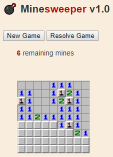

# Minesweeper
## About this version
- **Author :** [Oussama Ben Khiroun](https://oussamabenkhiroun.com/)
- **Language :** JavaScript using [jsboard](https://github.com/danielborowski/jsboard) library (credits to [danielborowski](https://github.com/danielborowski))
- **Algorithm :** Use of recursive grid exploration in case of zero neighbour mines
- **Design :** Microsoft (Windows XP) using sprites
- **Source Code :** [https://github.com/oussbenk/minesweeper](https://github.com/oussbenk/minesweeper)
- **Game Demo :** [https://oussbenk.github.io/minesweeper/](https://oussbenk.github.io/minesweeper/)

> 

## About Minesweeper
[Minesweeper](https://en.wikipedia.org/wiki/Minesweeper_(video_game)) is a single-player puzzle video game. 
The objective of the game is to clear a rectangular board containing hidden "mines" or bombs without detonating any of them, with help from clues about the number of neighboring mines in each field [[Wikipedia]](https://en.wikipedia.org/wiki/Minesweeper_(video_game)).
